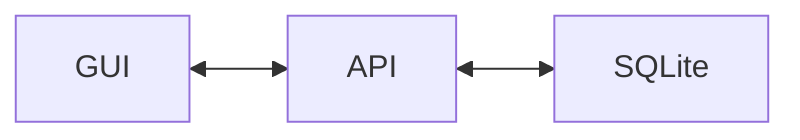
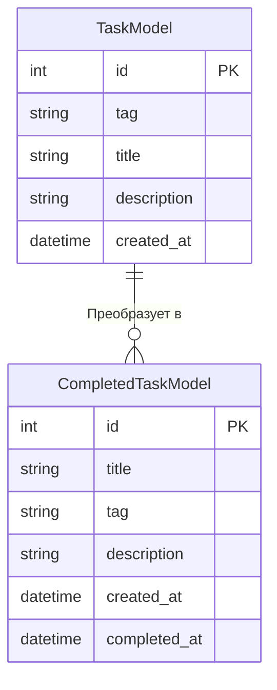

## About 💭
Когда я начал изучать `FastAPI`, то долго думал над тем, чтобы придумать и написать проект, где его части будут общаться между собой через `HTTP`. 
Спустя время я пришел к банальной, но рабочей идее - `to-do list`, но с особенностями.

## Technologies ⚙️

- Backend
  - FastAPI 
  - SQLAlchemy(sqlite + aiosqlite)
  - Asyncio

- Frontend
  - Electron.js 
  - UiKit
  - HTML + CSS + JS 

Из этого списка новым для меня оказались `UiKit`, `Electron.js` и `Asyncio`. Раньше я не работал с асинхронным кодом, но в этом проекте решил попробовать. Я думал, что это будет тяжело, но несколько обучающих видео и простых задач меня переубедили. Идея написать десктопное приложение преследовала меня очень давно. По этой причине я выбрал `Electron.js`. Меня очень заинтересовала данная технология.

## Tasks and Ideas 💡

| Task | Status | 
| ---- | ------ |
| Настройка и подготовка FastAPI | ✅ |
| Настройка и подготовка модели активных задач| ✅ |
| Взаимодействиe через HTTP | ✅ | 
| GUI | ✅ |
| Отрисовка данных из БД | ❌ |
| Кнопка редактирования задачи | ❌ |
| Кнопка удаления задачи | ❌ |
| Поиск | ❌ | 
| Фильтр по тегу | ❌ |
| Настройка и подготовка модели выполненных задач | ❌ |
| Отображение выполненных задач | ❌ |

## Future 🚀
Проект ещё не готов. Планирую в скором будущем реализовать отображение данных из БД, а сразу после нужно будет написать несколько функций для работы с фильтром, поиском, удалением и редактированием. Другими словами - реализовать полный принцип CRUD.

Сейчас ещё думаю над реализацией авторизации/ауентификации, но для списка задач звучит как-то бесполезно.

## Graph and Diagram 📊

Здесь будет изображен граф того, как именно работает проект. Проект реализует MVP паттерн. За View отвечает GUI, за Presenter - API, а за Model - Sqlite. 

---
Структура Базы Данных. CompletedTaskModel на данный момент не реализована, но в будущем будет. 

* Поле `created_at` на текущий момент не реализовано
